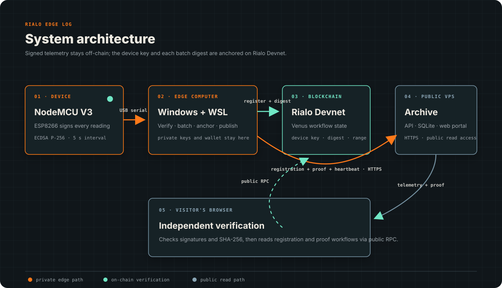
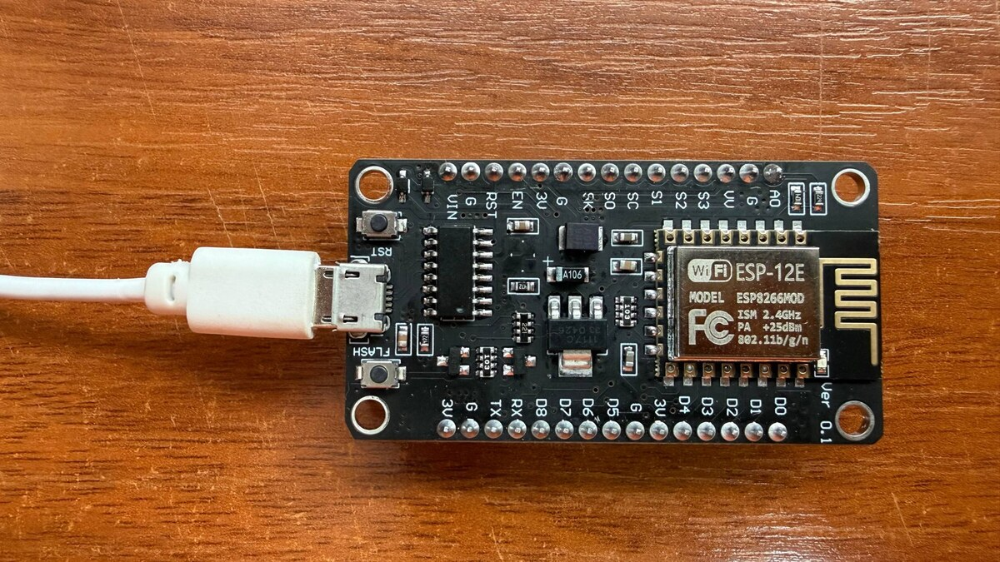

# Rialo Edge Log

Rialo Edge Log is a small IoT experiment that makes later changes to telemetry
detectable. An ESP8266 signs each reading, a gateway groups the readings into
batches, and the batch digest is recorded on Rialo Devnet. The readings stay
off-chain and can be published to a public archive for browser-based checks.

The current firmware uses simulated temperature values. A DS18B20 is the next
hardware step; replacing the data source will not change the signing, batching,
or verification flow.

## How it works

```text
ESP8266 -> Windows gateway -> signed batch -> Rialo Devnet
                                      |
                                      +-> public archive -> browser verification
```

1. The ESP8266 signs every JSON reading with its own ECDSA P-256 key.
2. The local gateway verifies the signature and builds a deterministic batch.
3. The project registrar records the device ID and public-key fingerprint once
   in a dedicated Rialo workflow.
4. A SHA-256 digest of each batch is stored in a separate Rialo Venus workflow.
5. The confirmed batch, registration receipt and public proof are sent to the
   archive.
6. A visitor can recalculate the digest, verify the device signatures and
   independently read both workflow records from Rialo in the browser.

Private keys, wallet files, and ingestion credentials never leave the edge
computer. Raw telemetry is stored off-chain.



The editable Mermaid source is available in
[`docs/architecture.mmd`](docs/architecture.mmd).

## Hardware prototype



This is the NodeMCU V3 currently producing and signing the live telemetry shown
in the public archive. Temperature is still simulated in firmware; a physical
DS18B20 will be connected in the next hardware revision.

## What is running now

- NodeMCU V3 telemetry simulator with per-reading signatures
- Windows serial gateway with five-minute batches (60 readings by default)
- automatic Rialo Devnet submission through the CLI in WSL
- receipts linking each batch to its transaction and workflow account
- HTTPS archive at [rialo-edge-log.xyz](https://rialo-edge-log.xyz)
- independent browser checks and links to the matching RialoScan records
- Docker deployment for the archive and hidden Windows background tasks
- signed boot-session, reset-reason, and enclosure-tamper telemetry fields
- one-minute signed heartbeats for live device presence on the public portal
- one-time on-chain registration of the device ID and public-key fingerprint

The deployed Venus program ID is
`AfbPSJCLnmAAxhG66QoSV1Pp3WbTY6VNx55SZoKBnB7x`.

An early confirmed example covers device `edge-0E0473`, sequences `73-84`:

- workflow: `2zFvYcDgb4US6RHcPhvTVAQTcTK8T9R6hf9iNLHANUsp`
- transaction: `2WbkTi4SB7449Yhy8Rwo1XwxwiGZLdn1dDqYhL4TYqnoTsStGXKuayH2WchFYnkD1jntoaW5mPYcCjRKJMFqBRXL`

## Repository map

- [`firmware/nodemcu_signed`](firmware/nodemcu_signed) — signed ESP8266 firmware
- [`firmware/nodemcu_simulator`](firmware/nodemcu_simulator) — unsigned starter sketch
- [`gateway`](gateway) — serial collection, batching, anchoring, and publishing
- [`rialo/edge-log-proof`](rialo/edge-log-proof) — Venus workflow
- [`archive`](archive) — public archive and API
- [`portal`](portal) — RU/EN browser interface and verifier
- [`deploy`](deploy) — VPS and Windows task setup

Each directory has its own setup notes. For the complete Windows data path,
start with [`gateway/README.md`](gateway/README.md).

## What the proof does and does not prove

The proof shows that a published batch matches the readings signed by the
on-chain registered device key and the digest recorded on Rialo. The browser
also checks that the registration transaction was signed by the project's
published registrar wallet. If an archived value is edited later, verification
fails.

It does not prove that the sensor was calibrated, installed correctly, or
measured the physical world accurately. Device compromise before signing is
also outside this prototype's trust boundary.

Schema-3 readings bind the device boot session, ESP8266 reset reason, and
tamper-switch state to the same device signature as the temperature. Heartbeat
delivery is operational metadata: the archive accepts it only after verifying
the latest reading and matching its key to a previously published device.

## Next steps

- read temperature from a physical DS18B20 instead of the simulator
- make workflow identifiers easier to trace across long-running deployments
- add an end-to-end test covering collection, anchoring, publication, and
  browser verification
- review a lower anchoring frequency for longer runs

## Security and project status

This repository is for development and Devnet use. Do not commit Wi-Fi
passwords, private keys, wallet files, ingestion tokens, or generated telemetry.
Rialo Devnet can reset without notice. Receipts from an earlier network state
remain useful as local history but cannot prove current on-chain availability.

This is an independent open-source experiment on Rialo Devnet. It is not
affiliated with or endorsed by Rialo Labs or Subzero Labs and is not official
Rialo software.
